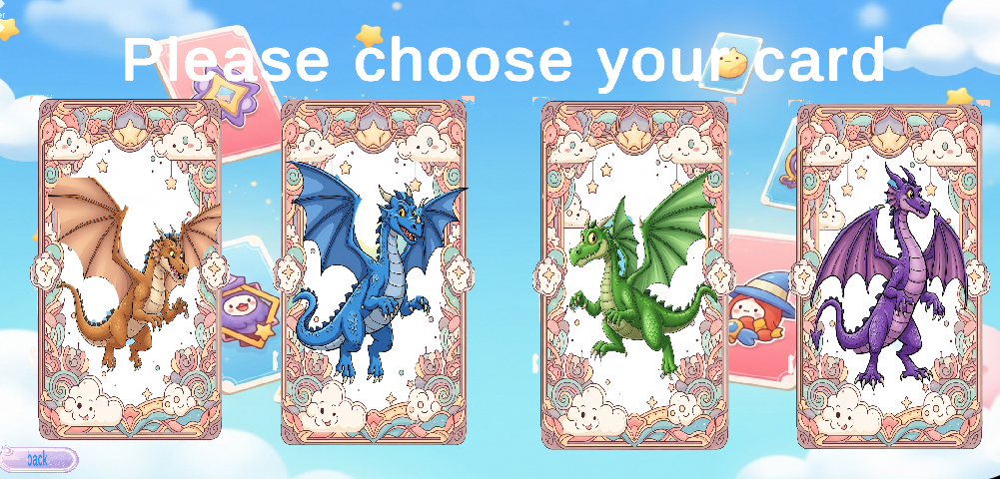
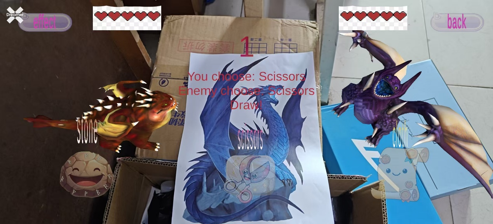
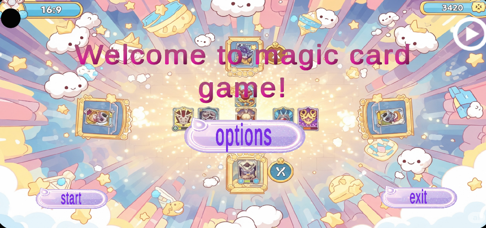

# 🃏 AR异界召唤：猜拳对战

《AR异界召唤：猜拳对战》是一款基于 **Unity** 与 **Vuforia** 引擎开发的增强现实（AR）互动小游戏，融合经典“石头剪刀布”玩法与虚拟角色召唤机制，打造沉浸式人机对战体验。玩家通过手机扫描实体召唤图卡，即可在现实空间中生成炫酷的魔法角色，并通过简洁的触控操作完成猜拳对战。

> 适合用于虚拟现实课程教学、互动展示或移动端休闲娱乐，具有开发难度适中、创意十足、演示效果直观的特点。

---

## 🎮 游戏玩法

1. **召唤角色**：扫描实体图卡，AR 角色将在现实空间中现身
2. **选择手势**：点击屏幕上的【石头】【剪刀】【布】按钮
3. **五局对战**：系统自动判定胜负，血量变化，特效 + 动作反馈
4. **胜负结算**：五局后血量高者胜，播放胜利/失败界面

---

## ✨ 核心交互与展示

### 🖐️ 图卡识别交互（AR图像识别）
- 通过 Vuforia 引擎识别实体图卡
- 在图卡上方生成 3D 角色 + 召唤特效

### 🎮 玩家操作交互
- **开始界面**：选择、开始、退出、声音开关
- **选择界面**：角色图鉴、详情展示、返回按钮
- **游戏界面**：石头/剪刀/布按钮、血量显示、倒计时、特效反馈

### ⚔️ 胜负判定与反馈
- 冻结按钮 3 秒
- 显示选择结果文本 + 倒计时
- 释放对应粒子特效（火焰、雷电等）
- 播放角色动作（攻击/闪避）
- 血量变化提示

### 🏁 结果界面
- 弹窗提示胜负
- 按钮：【再来一局】【退出】

---

## 🧱 项目资源清单

| 资源类型 | 资源名称 | 来源 |
|---------|----------|------|
| 3D模型 | 八种恐龙角色 + 动作（Idle/Victory/Defeat） | Unity Asset Store + 自制 Controller |
| 脚本 | UI控制、识别控制、逻辑判断、动画控制（共5个） | 自写 + AI辅助 |
| 特效 | 召唤阵 + 8种技能特效（火焰/雷电/爆炸等） | FX Magic Pack（调整） |
| UI素材 | 背景、按钮、血条、倒计时UI | AI生图 + Photoshop |
| 音频 | 背景音效、胜负音效 | Freesound.org（CC0） |

---

## 📱 运行环境

- 支持平台：Android
- 开发引擎：Unity + Vuforia
- 适配设备：主流手机（支持AR功能）

---

---

## 🧪 项目小结

本项目成功实现了：

- ✅ 高稳定性图卡识别（成功率 >95%）
- ✅ 虚拟角色与实体环境的动态锚定
- ✅ 轻量化状态机管理系统
- ✅ 策略性猜拳对战机制（血量扣除 + 五局三胜）
- ✅ 分层响应式触控 UI，避免 AR 误操作
- ✅ 动态视觉反馈（动作 + 特效 + 音效）

### 🔮 未来可扩展方向

- 联网双人对战（PvP）
- 更多角色与技能系统
- 积分排名机制
- 角色养成与图鉴收集系统

---

## 📸 截图展示

---

## 📄 许可证

本项目仅供学习与展示使用，部分资源来自 Unity Asset Store 与 Freesound.org（CC0授权），请遵守各资源原作者许可协议。

---

## 👨‍💻 作者

- 项目作者：游戏开发者
- 技术栈：Unity、Vuforia、C#、Photoshop、AI生图
- 项目性质：AR课程实训 / 展示作品

---

> 如果你喜欢这个项目，欢迎 ⭐ 星标支持～
